## Ice Extent
Daily mean video showing ice extent for 2023
<video width="640" height="360" controls autoplay muted loop playsinline>
<source  src="../cmems_mod_arc_phy_anfc_6km_detided_P1D-m/2023/Annual/output.mp4" type="video/mp4">
 Your browser does not support the video tag.
</video>

### January
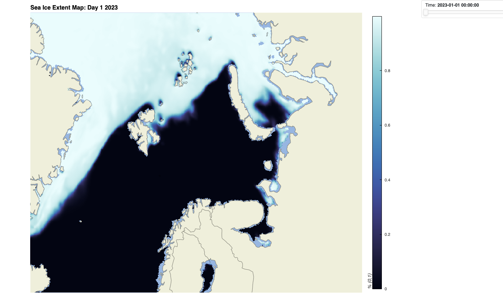
### February
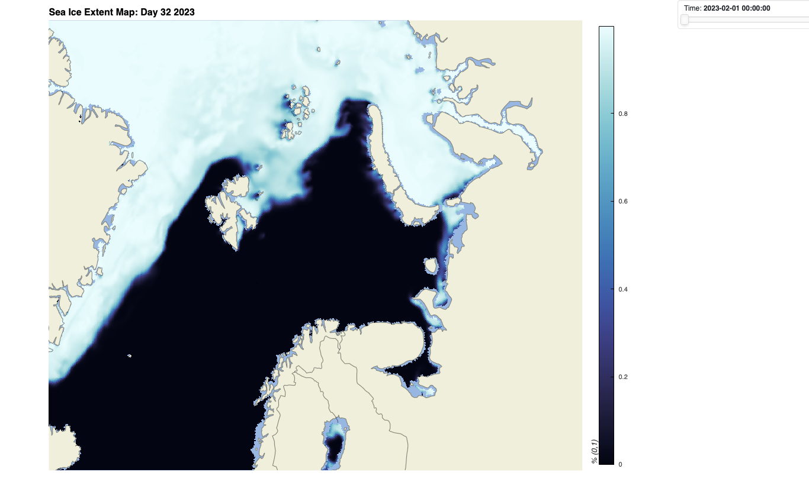
### March
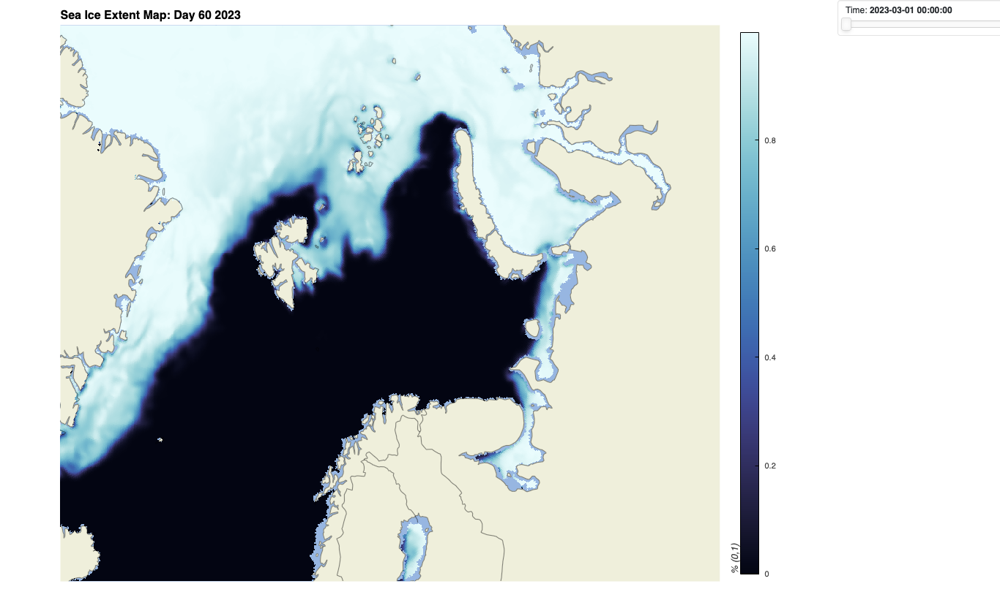
### April
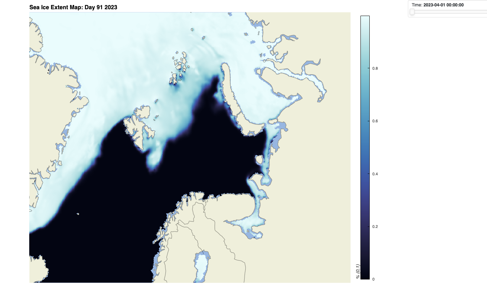
### May
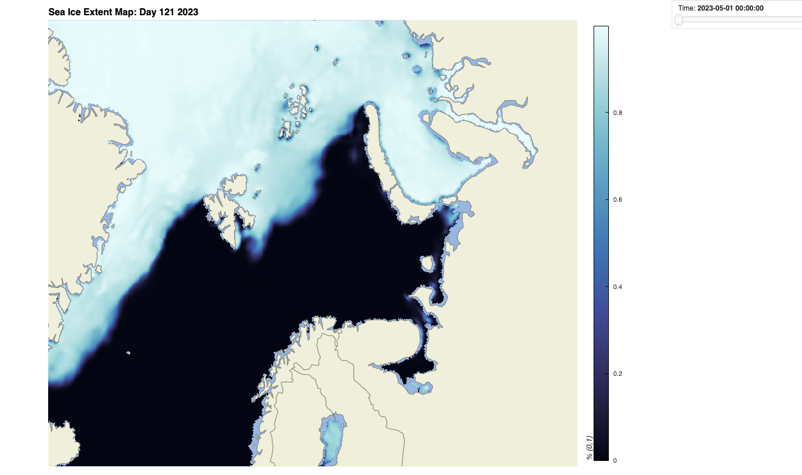
### June
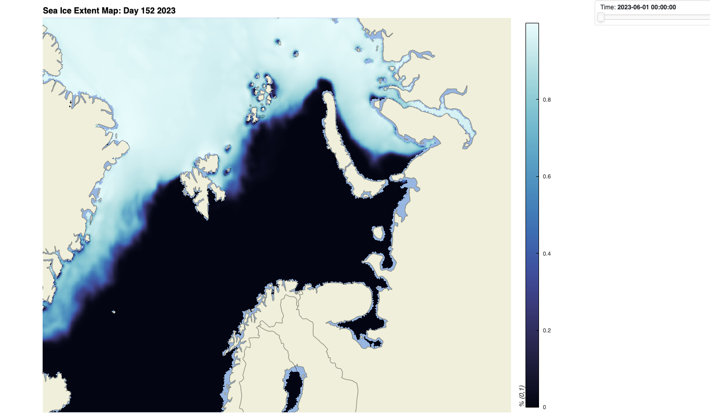
### July
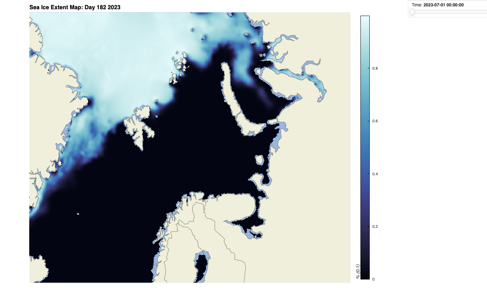
### August
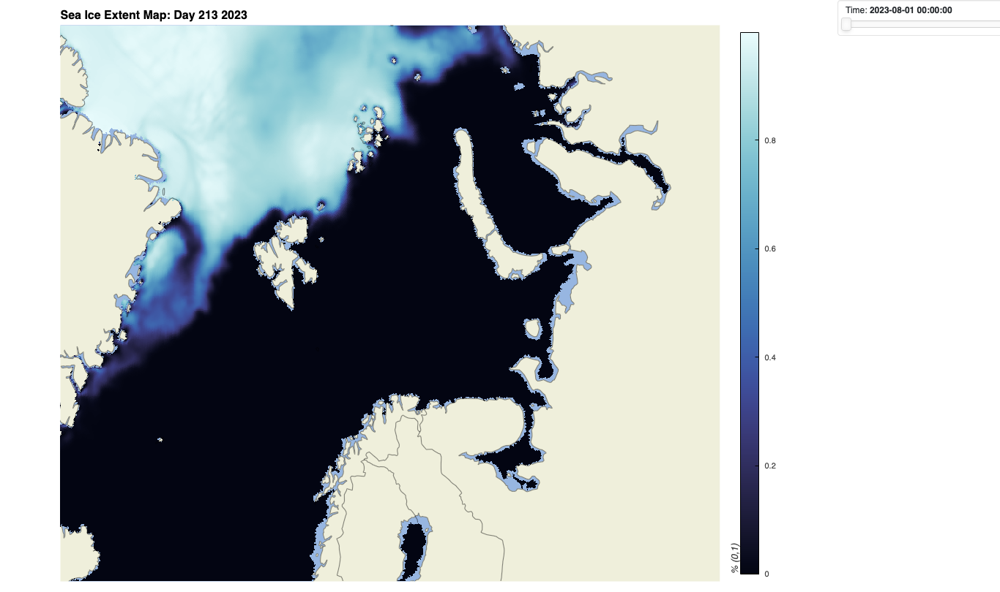
### September
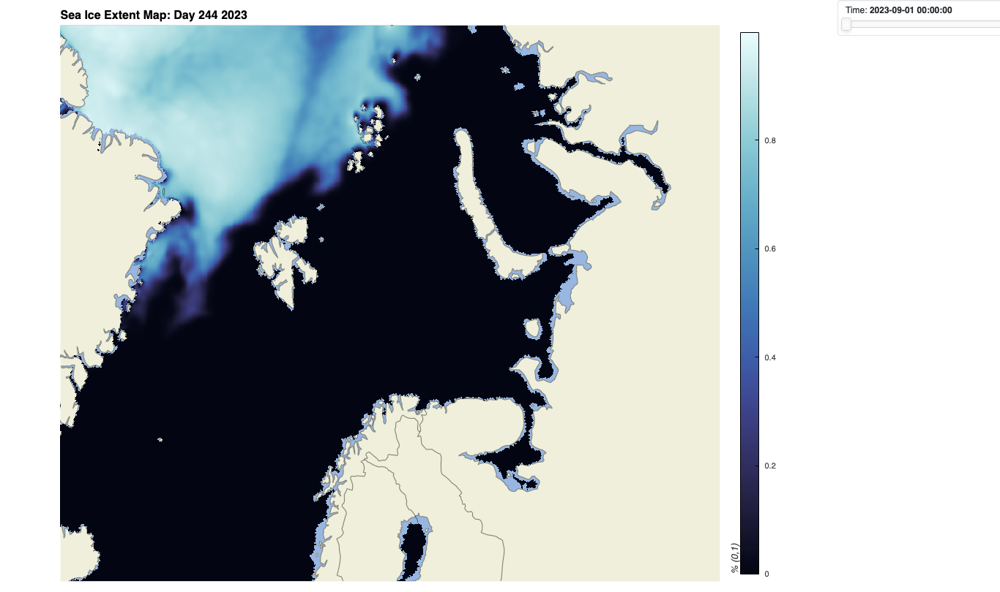
### October
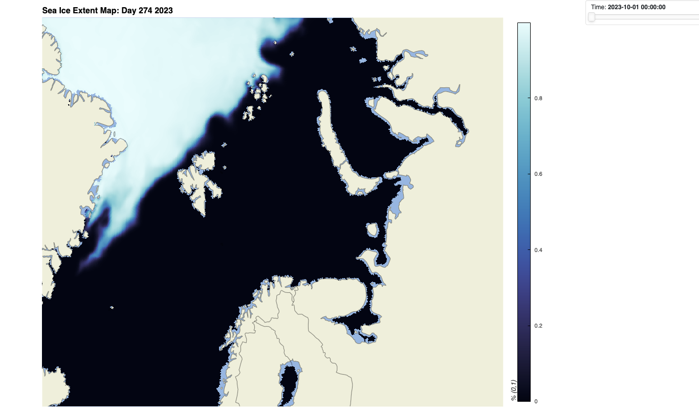
### November
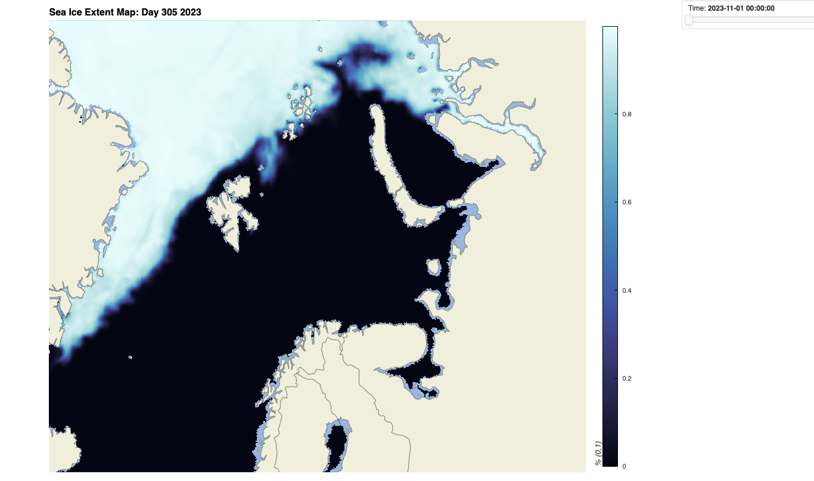
### December
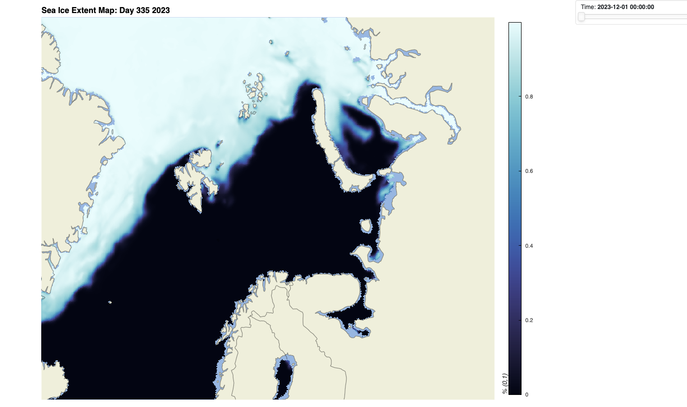